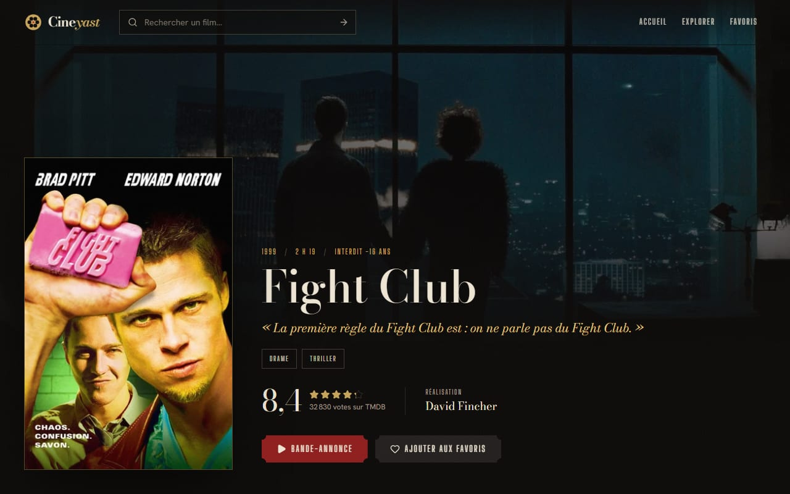

# Cinéyast

[](https://github.com/yboukamir/cineyast/actions/workflows/ci.yml)

Site de découverte et de recommandation de films pour cinéphiles — [cineyast.com](https://cineyast.com).
Tendances de la semaine, recherche par titre, filtres (genre, année, note), fiches détaillées avec casting,
bande-annonce et offres de streaming du pays du visiteur (Belgique, France, Suisse, Canada…), pages acteurs et réalisateurs avec leur filmographie,
recommandations, et une liste de favoris personnelle. Sur l'accueil, une rangée « Flashback » montre les films
sortis en salle en France la même semaine il y a 25 ans, et une autre les films belges et coproductions.

Conçu et développé par **Yassine Boukamir**. Toutes les données viennent de l'API publique
[TMDB](https://www.themoviedb.org/) — aucune donnée de film n'est codée en dur.


*Accueil — le film n°1 des tendances de la semaine : image cadrée, bandeau outremer et affiche qui chevauche la couture. Données réelles de l'API TMDB.*



*Fiche film — classification française, genres en plaques, note en tuiles, réalisation et bande-annonce.*

## Stack

| Rôle | Choix |
| --- | --- |
| UI | React 19, TypeScript, Tailwind CSS 4 |
| Routage | React Router (pages chargées à la demande) |
| Données | TanStack Query (cache, pagination infinie) |
| Animations | Motion |
| Polices | Bebas Neue (titres, chiffres, logo) · Figtree (texte), auto-hébergées via Fontsource |
| Design | Charte « L'Affiche » : maquette de Yassine Boukamir (outremer, jaune, crème, ombres dures, angles vifs) |
| Build | Vite |
| Production | Vercel (fonction serverless pour le proxy TMDB) — [cineyast.com](https://cineyast.com) |

### Composants issus du catalogue 21st.dev

Récupérés via le serveur MCP 21st.dev (Magic). Depuis la refonte « L'Affiche », leur **fonctionnement** est
conservé et leur **apparence** suit la maquette :

| Composant (auteur) | Fichier | Conservé · adapté |
| --- | --- | --- |
| Hero Carousel (crafterui) | `src/components/ui/hero-carousel.tsx` | lecture auto avec pause au survol et au focus, clavier, geste horizontal · rendu de la maquette (image cadrée, bandeau outremer), fondu et balayage au doigt |
| Rating (haydenbleasel) | `src/components/ui/rating.tsx` | étoiles partielles à la décimale, libellé accessible unique · étoiles jaunes à contour noir |
| Input + démo recherche (originui) | `src/components/ui/input.tsx`, `src/components/SearchBar.tsx` | champ `search` et formulaire `role="search"` · cadre noir, ombre dure, raccourci « / » |
| Scroller (diceui) | `src/components/ui/scroller.tsx` | détection des bords, défilement page par page · flèches dans l'en-tête de rangée |

Trois composants de la première version (Selector Chips, Movie Pass Button, Reveal on hover) ont été retirés :
la maquette les remplace par les plaques de genre, les boutons à ombre dure et des cartes sans survol révélé.

## 1. Obtenir une clé API TMDB (gratuite)

1. Créez un compte sur <https://www.themoviedb.org/signup> et validez l'e-mail de confirmation.
2. Connecté, ouvrez **Avatar → Paramètres → API** (<https://www.themoviedb.org/settings/api>).
3. Cliquez sur **Créer / Demander une clé d'API**, choisissez le type **Developer** et acceptez les conditions d'utilisation.
4. Remplissez le formulaire : type d'application *Website*, nom *Cineyast*, URL `https://cineyast.com`,
   courte description (« site perso de découverte de films, non commercial »), puis vos coordonnées.
5. La page API affiche alors deux identifiants — **l'un ou l'autre** fonctionne ici :
   - **Clé d'API** (v3) : 32 caractères hexadécimaux ;
   - **Jeton d'accès en lecture à l'API** (v4) : longue chaîne commençant par `eyJ…`.

L'usage est gratuit pour un projet non commercial. Un usage commercial demande une licence auprès de TMDB.

## 2. Développement local

```bash
npm install
cp .env.example .env      # puis collez votre clé dans TMDB_API_KEY
npm run dev               # http://localhost:5173
```

Sans clé, le site s'affiche quand même mais indique « La clé TMDB n'est pas encore configurée ».

## 3. Où vit la clé API (et pourquoi)

Un site React est du JavaScript exécuté **dans le navigateur du visiteur** : toute variable `VITE_*` est
recopiée en clair dans le bundle et lisible par n'importe qui (onglet Réseau, code source). La clé n'est
donc **jamais** côté client :

```
Navigateur ──► /api/tmdb.php?path=/movie/550 ──► api.themoviedb.org/3/movie/550?api_key=…
                (même domaine, sans clé)            (la clé est ajoutée ici, sur le serveur)
```

- **En développement**, `/api/tmdb.php` est servi par un middleware Vite (`server/tmdb-dev-proxy.ts`) qui lit
  `TMDB_API_KEY` dans `.env`. Pas de préfixe `VITE_` → la variable ne quitte pas Node.
- **En production sur Vercel**, c'est la fonction serverless `api/tmdb.js` qui s'en charge ; la clé est
  stockée dans les variables d'environnement du projet Vercel. `vercel.json` réécrit `/api/tmdb.php` vers elle,
  pour que le code client reste identique quel que soit l'hébergement.
- **Sur un hébergement PHP**, `deploy/php/api/tmdb.php` fait le même travail. Il cherche la clé, dans l'ordre :
  1. la variable d'environnement `TMDB_API_KEY` ;
  2. **`tmdb-config.php` placé un niveau au-dessus du dossier web** (méthode recommandée) ;
  3. `api/tmdb-config.php` (repli, accès HTTP bloqué par `api/.htaccess`).

Le proxy n'accepte qu'une liste blanche d'endpoints et de paramètres en lecture seule (impossible de s'en
servir pour autre chose que ce site), force `include_adult=false`, et met les réponses en cache 15 min sur le
serveur pour rester sous les limites de débit de TMDB.

`.env`, `.env.deploy` et `tmdb-config.php` sont exclus par `.gitignore`.

## 4. Build et tests

```bash
npm run build        # vérification TypeScript + build optimisé dans dist/
npm run preview      # sert dist/ avec les mêmes en-têtes de sécurité (CSP) que la prod
npm test             # suite de tests Vitest, environ 2 secondes
npm run test:watch   # relance les tests à chaque modification
npm run fixtures     # réenregistre les données de test (TMDB_API_KEY requise)
```

La CI (GitHub Actions) exécute la vérification TypeScript, les tests et le build à chaque push.

- **Aucune donnée inventée** : les tests utilisent de vraies réponses TMDB enregistrées dans `tests/fixtures`
  (liste, date et cas couverts dans son README). Aucun appel réseau pendant les tests : la CI n'a besoin d'aucune clé.
- **Couverture** : balises de partage (dont un instantané des balises de Fight Club), carte générée (rendu PNG
  réel et contraintes de Satori 0.29), filmographie (apparitions, postes non créatifs, tri), proxy TMDB (liste
  blanche, clé ajoutée côté serveur), slugs, formatage français, offres de streaming.
- **Concordance** : les règles recopiées entre le navigateur, les fonctions Vercel, le proxy de développement et
  le proxy PHP sont comparées automatiquement (listes blanches, métiers, films les plus connus, URL canoniques).
- **Vérifiée par mutation** : huit bugs rencontrés pendant le développement ont été réintroduits un par un, et
  chacun fait échouer la suite.

## 5. Déploiement sur Vercel

Le dépôt GitHub est connecté à Vercel : chaque `git push` sur `main` redéploie le site.

1. Sur <https://vercel.com>, **Add New → Project**, importer le dépôt `cineyast`.
2. Vercel détecte Vite tout seul (build `npm run build`, sortie `dist`) — ne rien changer.
3. **Environment Variables** : ajouter `TMDB_API_KEY` avec votre clé, pour les trois environnements
   (Production, Preview, Development). C'est le seul endroit où elle vit côté serveur.
4. **Deploy**, puis vérifier <https://VOTRE-PROJET.vercel.app/api/tmdb.php?path=/genre/movie/list> :
   la liste des genres doit s'afficher en JSON.
5. **Settings → Domains** : ajouter `cineyast.com`, puis créer chez votre registrar les enregistrements DNS
   indiqués par Vercel (un `A` sur l'apex et un `CNAME` pour `www`). Le certificat HTTPS est automatique.

Après modification de `TMDB_API_KEY`, il faut **redéployer** pour que la fonction prenne la nouvelle valeur.

## 6. Alternative : hébergement PHP (LWS, OVH, o2switch…)

Le proxy PHP est conservé dans `deploy/php/` — volontairement **hors de `public/`**, sinon il serait copié
dans `dist/` et Vercel servirait son code source en clair au lieu d'exécuter sa fonction.

Arborescence attendue sur l'hébergement :

```
/                         ← racine FTP (non publique)
├── tmdb-config.php       ← votre clé, hors d'atteinte depuis Internet
├── cineyast-cache/       ← créé automatiquement par le proxy
└── htdocs/               ← contenu de dist/ + deploy/php/
    ├── .htaccess
    ├── index.html
    ├── assets/…
    └── api/
        ├── .htaccess
        └── tmdb.php
```

1. Vérifier que **PHP ≥ 7.4** est actif et activer le certificat SSL de l'hébergeur.
2. Copier `deploy/tmdb-config.example.php` en `deploy/tmdb-config.php` et y coller la clé.
3. Copier `.env.deploy.example` en `.env.deploy`, renseigner les accès FTP, puis :
   ```bash
   npm run build
   npm run deploy -- --config
   ```
   (ou envoyer à la main `dist/` **et** `deploy/php/` dans le dossier web avec FileZilla).
4. Tester `/api/tmdb.php?path=/genre/movie/list`.
5. Une fois le HTTPS actif, décommenter les 3 lignes « HTTPS forcé » de `deploy/php/.htaccess` et redéployer.

## 7. Aperçus de partage des fiches films et des pages personnes

Les robots de LinkedIn, WhatsApp ou Slack n'exécutent pas JavaScript : sans traitement, chaque fiche film
partagée affichait l'aperçu générique de la page d'accueil.

`vercel.json` réécrit donc `/film/:slug` et `/personne/:slug` vers la fonction `api/share.js`, qui lit l'`index.html` du
déploiement et y injecte les balises de la page. Pour un film : titre et année, synopsis tronqué à 200 caractères, image
paysage (1280×720), URL canonique sur `cineyast.com`, Open Graph et Twitter. Les visiteurs reçoivent la
même application React ; la réponse est mise en cache une heure sur le CDN.

Pour une personne : nom, biographie tronquée à 200 caractères (à défaut, métier et films les plus connus),
URL canonique, et une **carte 1200×630 générée** par `api/og/personne.js` : portrait entier, métier, nom et
films les plus connus. Un portrait brut ne convenait pas : LinkedIn recadre au centre les images portrait en
grande carte paysage, ce qui coupait le visage.

- La carte utilise `@vercel/og` **épinglé en 1.0.1** : la 1.0.2 ne fonctionne pas dans un projet ESM
  (`require` dynamique) et embarque une dépendance vulnérable.
- Polices statiques en woff dans `api/og/_fonts` (le moteur ne lit pas le woff2), incluses dans la fonction
  via `vercel.json`.
- `public/robots.txt` autorise `/api/og/` : sans cela, le robot de LinkedIn refuserait de télécharger l'image.
- Seul l'identifiant est lu dans l'URL de la carte ; nom et films viennent de TMDB, pour qu'on ne puisse pas
  fabriquer de fausse carte au nom du site.

Si l'identifiant est inconnu ou si TMDB ne répond pas, la page d'origine est servie telle quelle.

- **Tester un aperçu** : <https://www.linkedin.com/post-inspector/> avec l'URL de la fiche. Relancer
  l'inspection force aussi LinkedIn à rafraîchir son cache.
- **En développement**, `npm run dev` sert l'application sans cette fonction : les balises des fiches ne
  sont enrichies qu'une fois déployé sur Vercel.

### Sitemap

`vercel.json` réécrit `/sitemap.xml` vers `api/sitemap.js`, déclaré dans `public/robots.txt` et envoyé dans
Google Search Console (propriété « domaine » cineyast.com). Il liste l'accueil, Explorer, puis les fiches des
listes TMDB les plus cherchées : tendances de la semaine, films populaires, mieux notés, à l'affiche en France
et personnalités populaires, soit environ 350 URL. Les liens sont exactement ceux de l'application (même
`slugify`, titres en français), ce que vérifie `tests/sitemap.test.ts`.

- Réponse en cache une journée sur le CDN ; si une liste TMDB échoue, le sitemap reste valide avec ce qui a
  été obtenu, en cache de dix minutes.
- Les favoris sont exclus : la page dépend du navigateur du visiteur, un robot la verrait vide.

## 8. Attribution TMDB

Le pied de page affiche les deux éléments exigés par les conditions d'utilisation de TMDB :

- la mention « Ce produit utilise l'API TMDB mais n'est pas approuvé ou certifié par TMDB » ;
- le **logo officiel** (`public/tmdb-logo.svg`, version courte issue de
  <https://www.themoviedb.org/about/logos-attribution>), lié à themoviedb.org et moins proéminent que le
  logotype Cinéyast. Il est servi depuis le domaine, la CSP n'autorisant que les images locales et TMDB.

La section **« Où regarder »** des fiches films affiche les offres du pays du visiteur (abonnement, location, achat),
issues de l'endpoint `watch/providers` de TMDB, lui-même alimenté par JustWatch. TMDB exige d'attribuer ces
données à JustWatch : la mention « Disponibilités fournies par JustWatch », avec un lien, figure sous les offres.
Elles arrivent dans la même requête que la fiche (`append_to_response`), sans appel réseau supplémentaire.

Le pays des offres est celui du visiteur, parmi 14 pays francophones où TMDB référence des offres
(`src/lib/pays.ts` : Belgique, France, Suisse, Canada, Luxembourg, Monaco, Maroc, Algérie, Tunisie,
Sénégal, Côte d'Ivoire, Cameroun, Madagascar, Maurice). Ordre de priorité : le choix fait dans le menu « Pays »
de la fiche (mémorisé dans le navigateur), le pays de la connexion renvoyé par `api/pays.js` (en-tête
`x-vercel-ip-country` de Vercel, réponse jamais mise en cache), la région de la langue du navigateur
(`fr-BE`, `fr-CA`…), puis la France. Les listes de sorties en salle restent françaises : TMDB y est bien
mieux renseigné qu'en Belgique.

## Structure

```
src/
├── components/
│   ├── ui/          composants 21st.dev adaptés (carrousel, note, champ, défilement) et liste déroulante
│   ├── movie/       carte, affiche, rangée, grille, bande-annonce, offres de streaming, bouton favori
│   ├── explore/     panneau de filtres
│   └── layout/      en-tête, pied de page, logo, page d'erreur
├── hooks/           requêtes TMDB, favoris (localStorage), utilitaires
├── lib/             client TMDB typé, formatage FR, slugs
├── lib/filmography.ts  regroupement des crédits (réalisation, rôles, scénario, production, apparitions)
├── lib/flashback.ts    période de la rangée Flashback (semaine de sortie du mercredi au mardi, repli sur le mois)
└── pages/           Accueil, Explorer, Fiche film, Fiche personne, Favoris, 404
api/tmdb.js          proxy TMDB en fonction serverless (Vercel)
api/share.js         balises de partage des fiches films et des pages personnes (Vercel)
api/og/personne.js   carte de partage 1200×630 des pages personnes, polices dans api/og/_fonts (Vercel)
api/pays.js          pays du visiteur pour les offres de streaming (en-tête Vercel, sans cache)
api/sitemap.js       sitemap.xml : pages fixes et fiches des listes TMDB les plus cherchées (Vercel)
server/              proxy TMDB de développement + CSP partagée
public/              favicons, robots.txt (avec la ligne Sitemap)
deploy/php/          .htaccess + proxy PHP, pour un hébergement mutualisé
vercel.json          réécritures (/api/tmdb.php, /film/:slug, /personne/:slug, /sitemap.xml, repli SPA) et en-têtes de sécurité
tests/               tests Vitest ; réponses TMDB réelles enregistrées dans tests/fixtures
scripts/             déploiement FTP, enregistrement des données de test
```

## Pistes pour la v2

- Pré-rendu du contenu complet des fiches pour le référencement (les balises de partage sont déjà servies)
